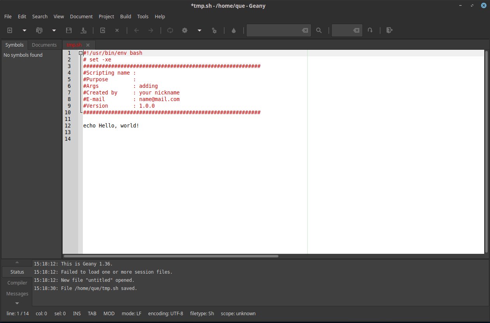
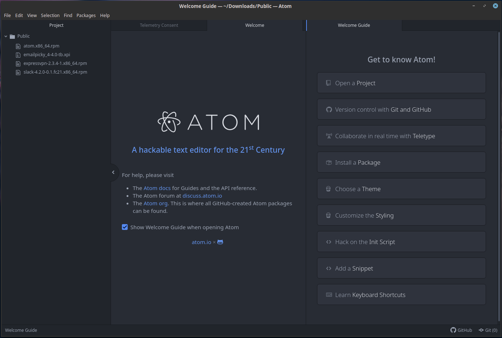
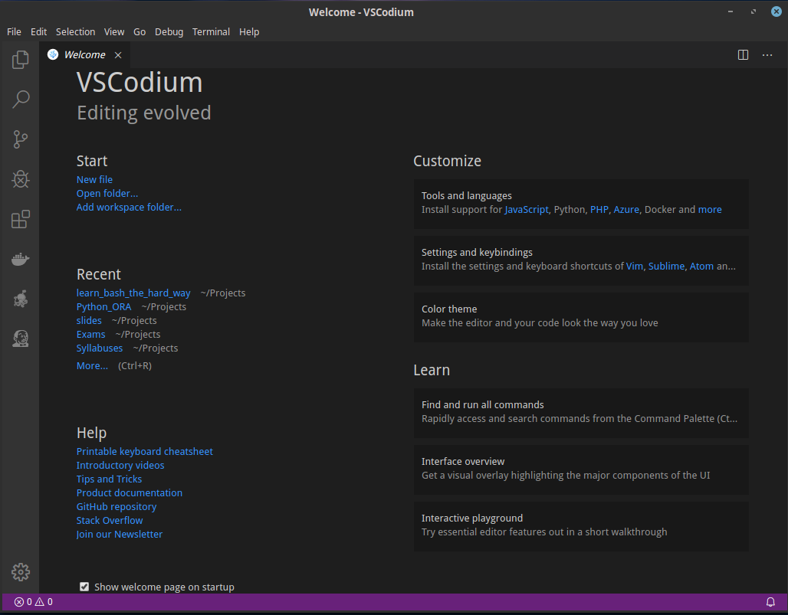

<!-- learn echo and printf -->

# Hello World

A `shell script` is a file containing one or more commands that you would type on the command line.


## the code itself.

The code itself is nothing more then 3 words, one commend and 2 arguments that it is getting: 

```sh
echo Hello, World!
```

### Some Monir Decissions

Before you turn that code into a script, you need to make two decisions: **_what will you call the script_** and **_where you will put it_**.

#### Naming the script:

As you can already guess from initial questioned asked, naming the script can be a trick task. for example, it might be an error to call the script `test`, due to a fact that the test is a shell built-in.

```sh
[que@core]$ type test
test is a shell builtin
[que@core]$ type -a test
test is a shell builtin
test is /usr/bin/test
```
Typically, Unix command names are as short as possible. They are often the first two consonants of a descriptive word (for example, mv for move or ls for list) or the first letters of a descriptive phrase.

Many shell developers add a suffix, such as `.sh`,to indicate that the program is a shell script. The script doesn’t need it, and I use one only for programs that are being developed. The suffix is `-sh`, and when the program is finished, I'd  suggest remove it. A shell script becomes another command and doesn’t need to be distinguished from any other type of command.

#### Directory for the Script:

When the shell is given the name of a command to execute, it looks for that name in the directories listed in the `PATH` variable. This variable contains a colon-separated list of directories that contain executable commands.
directories that contain executable commands. This is a typical value for $PATH `:/bin:/usr/bin:/usr/local/bin:/home/.local/bin`

As such, you iwsh to run your script from shell, you must place it under PATH or edit PATH to reach your script by editing the PATH.
Commands are usually stored in directories named `bin`, and a user’s personal programs are stored in a `bin` subdirectory in the $HOME directory. To create that directory, use this command:

```sh
[que@core] mkdir $HOME/bin
```

Now that it exists, it must be added to the PATH variable:

```sh
[que@core]PATH=$PATH:$HOME/bin
```

For this change to be applied to every shell you open, add it to a file that the shell will source when it is invoked. This will be .bash_profile, .bashrc, or .profile depending on how bash is invoked. These files are sourced only for interactive shells, not for scripts.

### Creating the script and running it

Creating shell script is not that  different from creating any other simple files. You can set it with `vim` or `nano` terminal editors. Although we'd suggest to use specific template for shell, python or ruby scripts according to their suffix.

To do so, we'd suggest to generate a template at your home directory `vim ~/.vim/sh_header.temp` and in the file write down the header for the script:

```sh
#!/usr/bin/env bash
# set -xe
#########################################################
#Scripting name :
#Purpose        :
#Args           : adding
#Created by     : your nickname
#E-mail         : name@mail.com
#Version        : 1.0.0
#########################################################
```
and once that's done configure our vim to handle your files with `.sh` suffix. To do so add the next line to `vimrc` file in your home directory. 

```sh
filetype indent on
filetype plugin on
syntax on

au bufnewfile *.sh 0r /home/$USER/.vim/sh_header.temp
```
Where:

- `au` – means autocmd
- `bufnewfile` – event for opening a file that doesn’t exist for editing.
- `*.sh` – consider all files with .sh extension

so to conclude, after generating a file and adding in to it, script commands with `hw` script at `/home/que/bin` folder:

```sh
#!/usr/bin/env bash
# set -xe
#########################################################
#Scripting name :
#Purpose        :
#Args           : adding
#Created by     : your nickname
#E-mail         : name@mail.com
#Version        : 1.0.0
#########################################################

echo Hello, world!
```
That works, but it’s not entirely satisfactory. You want to be able to type hw, without having to precede it with bash, and have the command executed. To do that, give the file execute permissions: `chmod +x bin/hw` .Now the command can be run using just its name:

```sh
[que@core]$ hw
Hello, world!

```

### Building better scripts.

When writing scripts, one must take into considiration, different specs:
- modularity : your scripts should be built in a way,  that will make easy to edit them.
- expressiveness : variables and function names should be usefull.
- extansibility : invoking your scripts should be by you and by others(users, groups, scripts) as well.

In that manner our script can be upgraded in next manner:


```sh
#!/usr/bin/env bash
# set -xe
#########################################################
#Scripting name :
#Purpose        :
#Args           : adding
#Created by     : your nickname
#E-mail         : name@mail.com
#Version        : 1.1.1
#########################################################
msg_hello="Hello, World!"

printf "%s\n" "$msg_hello" !"
```

**NOTE** Mind that version number was advanceds due to minor and misc changes in code.


### echo and Why You Should Avoid It
When I started writing shell scripts, I soon learned about the two main branches of Unix: AT&T’s System V and BSD. One of their differences was the behavior of echo. An internal command in all modern shells, echo prints its arguments with a single space between them to the standard output stream, followed by a newline: 
```sh
[que@core]$ echo duckity duck
duckity duck
```
The default newline can be suppressed in one of two ways, depending on the shell:
```sh
$echo -n No newline 
No new line$ 
```
or via the other way:
```sh
echo "No newline\c" No newline
```
The BSD variety of echo accepted the option-n, which suppressed the newline. AT&T’s version used an escape sequence, \c, to do the same thing.The trouble is that bash has an xpg_echo option (XPG stands for X/Open Portability Guide, a specification for Unix systems) that makes echo behave like that other version. This can be turned on or off while in the shell (using shopt -sxpg_echo either at the command line or in a script), or it can be turned on when the shell is compiled. In other words, even in bash, you cannot be absolutely sure which behavior you are going to get. If you limit the use of echo to situations where there cannot be a conflict, that is,where you are sure the arguments do not begin with -n and do not contain escape sequences, you will be fairly safe. 

### A word of advice about text processors and IDE's

For many people, one of the most important pieces of computer software is a  text processor. A text editor a toolfor creating  shell scripts, PostScript programs, webpages, and more.A text editor operates on plain-text files. It stores only the characters you type. You can write scripts in any text editor, from the basic vi or nano to the full-featuredemacs or nedit. The better text editors allow you to have more than one file open at atime. They make editing code easier with, for example, syntax highlighting, automatic indentation, autocompletion, spell checking, macros, search and replace, and undo. Ultimately, which editor you choose is a matter of personal preference. During this book, I used VIM with bunch of plugins, but i am not ashamed to climed that for other types of projects, I have used tools such as:
-  a lightweight IDE for general purpose of development.
-  a extencible text editor with bunch tools that can be added.
-  a clone project of atom and vscode with more native OpenSource licensing and agenda.
  
### Additional suggestion regarding code saving

From what i  have gather in these last decade, most of people treat Shell Script, as something expandable. thus usually when ever they need to save a script/tool they tend to drop it in some folder and use, `but there is no update for those same tools and usually they are considered re-doable.`
I personally consider Shell Script to be on the same level as any other scripting or development language. Meaning that, there is a roadmap or plan that will be the guidance to future of that specific script or set of scripts.

Long story short - All languages use `Version Control`: the most popular of them all being `git`. Git is distributed version control system and to use it locally, you only need to have git on your PC/Laptop/Device. 

Every git uses remote server to save the code and most of them do it for free, mainly because of the tool being OpenSource.
here is a list of those services and some other tutorials:
- simple git tutorial to get [started](https://rogerdudler.github.io/git-guide/)

- [git](https://git-scm.com/) 
- [github](https://github.com/)
- [gitlab](https://gitlab.com)
- [bitbucket](https://bitbucket.org/)
- there are bunch of other with additional service and you are welcome to [check](https://www.git-tower.com/blog/git-hosting-services-compared/)

**NOTE** all the text editors above support git and can be performed from them.


[Exercises](../Exercises/00_hello_world/README.md)

