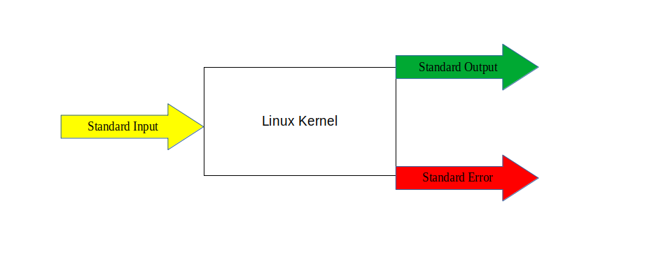

<!--managing data rediecting-->
# In, Out and Though
Two of the commands we used in previous chapter,are workhorses of the shell scripter’s stable: echo and printf. Both are bash builtin commands. Both print information to the standard output stream, and both have cons and pros.
In this chapter we'll go though them and try to explain why `printf` is more powerful and why  `echo` has problems.

## Paramenters and Variables

*_Definition_*: A **parameter** is an entity that stores values.

There are 3 main types of parameters: 
- Positional parameters: arguments that present on cli and they are refered by a number.
- Special parameters: set by the shell to store information about aspects of its own state, e.g. exit status of previous command.
- Variables: are sets of memory cell that can store data defined by user(you).

Lets dive into these 3 types little bit more:

### Positional Parameters

The arguments on the command line are available to a shell program as numberedparameters. The first argument is $1, the second is $2, and so on, until you get to $10, in which case you'll have to group those with curly braces {}.

what are the practical use cases ? here is an example:

write a script called `hello`,(you can copy/pasta it from previous script)

```sh
#!/usr/bin/env bash
# Description: print Hello and the first command-line argument

printf "Hello, %s!\n" "$1"
```
and when ever you will run the script with an argument, it will respond with the output:

```sh
[que@core]$ hello Alex
Hello, Alex!

[que@core]$ hello Johnny
Hello, Johnny!
```

The script is passed to the parameters that can be accessed via their positions, $0, $1,$2 and so on. The function shift N moves the positional parameters by N positions, ifyou ran shift (the default value of N is 1), then $0 would be discarded, $1 wouldbecome $0, $2 would become $1, and so on: they would all be shifted by 1 position. for example: if we'll take the same  `hello` script and add  shift to it the values will print out in different order:

```sh
#!/usr/bin/env bash
# Description: print Hello and the first command-line argument

shift 
printf "Hello, %s!\n" "$1"
```
here comes the output:
```sh
[que@core]$ hello Johnny Alex
Hello, Alex!
```

Thats all fine, but here is something to take into consideration: when ever you use `shift` command, the paramters discarded are gone and **cannot** be retrieved again.

---

### Special Parameters

These paramenters are called special mainly due to their use in shell itself. We could use them to try and get information about `positional parameters` or with `variables`.
The list of special goes as follows:

- $\@ - expention parameter: expand to the value of all the positional parameters combined.
- $\* - expention parameter: expand to the value of all the positional parameters combined.(yes - they are the same.)
- $\# - expands to the number of positional parameters. for examples, tell you how many elements you have in array(yes, that array, the construct in programming language.)
- $0 - contains the path to the currently running script or to the shell itself if no script is being executed. Mainly used instead of `hard coding` the script name in script.
- $\$ - contains the process identification number (PID) of the current process. thats you trace your script PID.
- $\? - is set to the exit code of the last-executed command. thats how you know if the command/s have succedded or not.
- $\_ - is set to the last argument to that command.
- $\! - contains the PID of the last command executed in the background.
- $\- - is set to the option flags currently in effect.


### Variables

A `variable` is a parameter denoted by a name; a name is a word containing only letters, numbers, or underscores and beginning with a letter or an underscore. Values can be assigned to variables in the following manner: 
```sh
name=VALUE
```
**Please Note**  that Bash is very particular about spacing: there are no spaces before the = and none after. If you have spaces, **_the command would not work_**.

## Standard Input, Output, Error Streams and Redirections.

In Unix and Linux distributions, everything is a stream of bytes. The streams are accessible as files, but there are three streams that are rarely accessed by a filename. These are the input/output (I/O) streams attached to every command: standard input, standard output, and standard error. By default, these streams are connected to your terminal. When a command reads a character or a line, it reads from the standard input stream,which is the keyboard. When it prints information, it is sent to the standard output, your monitor. The third stream, standard error, is also connected to your monitor; as the name implies, it is used for error messages. These streams are referred to by numbers, called file descriptors (FDs). These are 0, 1, and 2, respectively. The stream names are also often contracted to :

### A word about File Descriptors

In Linux and Unix, everything is a file. Regular file, Directories, and even Devices are files. Every File has an associated number called File Descriptor(FD).

Your screen also has a File Descriptor. When a program is executed the output is sent to File Descriptor of the screen, and you see program output on your monitor. If the output is sent to File Descriptor of the printer, the program output would have been printed. 



- Standard Input:  stdin  : 0 - your keyboard.
- Standard Output: stdout : 1 - your screen for outputs.
- Standard Error:  stderr : 2 - your screen for errors.
  


### Reirections: >,>>, 2>, 2>>, < and <<

I/O streams can be redirected to (or from) a file or into a pipeline... Yeah, really... `but what does it means? and how is it done?`

Redirection is a feature in Linux such that when executing a command, you can change the standard input/output/error devices. The basic workflow of any Linux command is that it takes an input and give an output. With redirection, the above standard input/output/error can be changed. Lets see some of the examples to emphesize those words:

#### Standard Input: stdin < <<

#### Standard Output: stdout > >>

#### Standard Error: stdout 2> 2>>

## Pipelines

Pipelines connect the standard output of one command directly to the standard input ofanother. The pipe symbol (|) is used between the commands:

```sh
[que@core]$ printf "%s\n" "$RANDOM" "$RANDOM" "$RANDOM" "$RANDOM"| tee FILENAME
618
11267
5890
8930
```
The tee command reads from the standard input and passes it to one or more files aswell as to the standard output. $RANDOM is a bash variable that returns a different integerbetween 0 and 32,767 each time it is referenced.

```sh
[que@core]$ cat FILENAME
618
11267
5890
8930
```

[Exercises](../Exercises/../01_in_out_and_through/README.md)